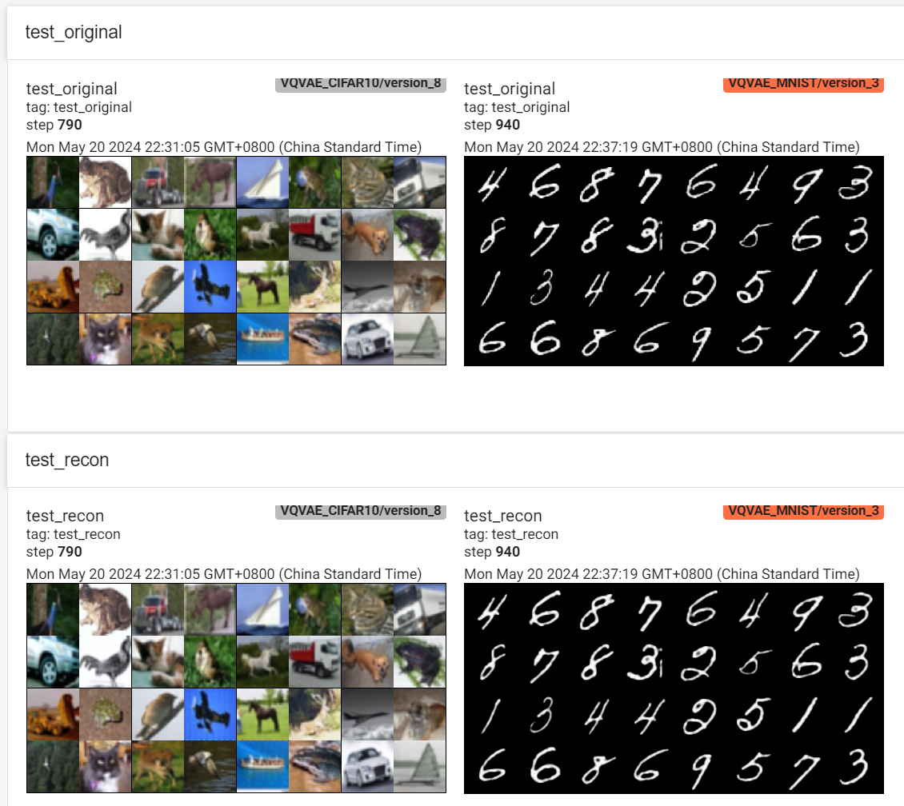

# MinVQVAE

Minimal Discrete Variational Autoencoder (VQ-VAE) implementation in PyTorch.

> Beyond VQ-VAE:2, get crazy performance.

## Performance

- 777K VQVAE with `SoftQuantize` of my implementation
- get `0.0002233` MSE Loss on CIFAR-10 test set
- just training 10 epochs cost 11 min on 2x RTX4090 GPUs

| Action                                                                  |  Mean duration (s)  |  Num calls             |  Total time (s)       |  Percentage %         |
|-------------------------------------------------------------------------|---------------------|------------------------|------------------------|-----------------------|
| Total                                                                   |  -                  |  32294                 |  663.84               |  100 %                |
| run_training_epoch                                                      |  56.897             |  10                    |  568.97               |  85.708               |
| [Strategy]DeepSpeedStrategy.validation_step                             |  1.4723             |  222                   |  326.84               |  49.235               |
| run_training_batch                                                      |  0.22579            |  790                   |  178.37               |  26.869               |