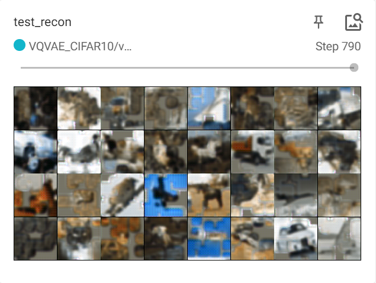
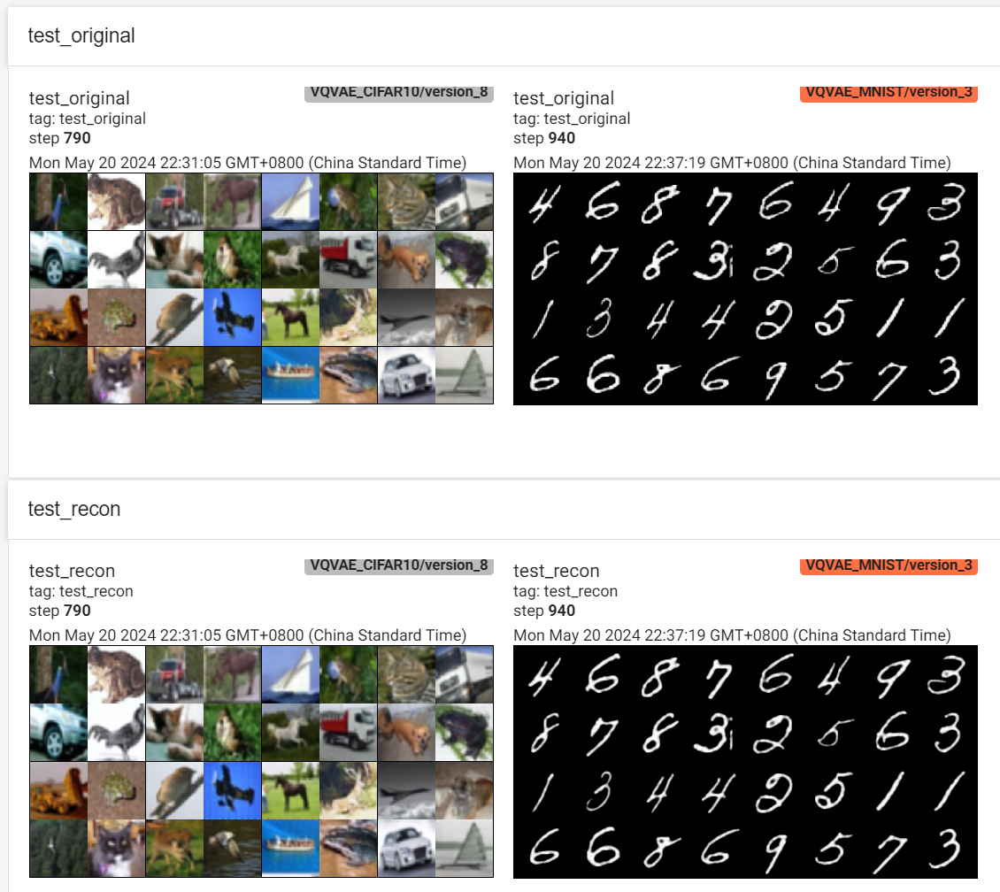

# MinVQVAE

Minimal Discrete Variational Autoencoder (VQ-VAE) implementation in PyTorch.

> Beyond VQ-VAE:2, get crazy performance.

## Performance

| Masked Test Set | Masked Reconstruct | Unmasked Reconstruct |
|-----------------|--------------|----------------|
|  |  |  |

- 777K unmasked VQVAE with `SoftQuantize` of my implementation
    - get `0.0002233` MSE Loss on CIFAR-10 test set
    - just training 10 epochs cost 11 min on 2x RTX4090 GPUs
- 777K patch_masked VQVAE with `SoftQuantize` 
    - `0.0092147` MSE Loss on CIFAR-10 test set
    - just training 10 epochs cost 13 min

## Others

- profile of trainning unmasked VQ-VAE

| Action                                                                  |  Mean duration (s)  |  Num calls             |  Total time (s)       |  Percentage %         |
|-------------------------------------------------------------------------|---------------------|------------------------|------------------------|-----------------------|
| Total                                                                   |  -                  |  32294                 |  663.84               |  100 %                |
| run_training_epoch                                                      |  56.897             |  10                    |  568.97               |  85.708               |
| [Strategy]DeepSpeedStrategy.validation_step                             |  1.4723             |  222                   |  326.84               |  49.235               |
| run_training_batch                                                      |  0.22579            |  790                   |  178.37               |  26.869               |

- profile of trainning masked VQ-VAE

| Action                                                                  |  Mean duration (s)  |  Num calls             |  Total time (s)       |  Percentage %         |
|-------------------------------------------------------------------------|---------------------|------------------------|------------------------|-----------------------|
| Total                                                                   |  -                  |  32294                 |  788.29               |  100 %                |
| run_training_epoch                                                      |  63.252             |  10                    |  632.52               |  80.24                |
| [Strategy]DeepSpeedStrategy.validation_step                             |  1.7755             |  222                   |  394.16               |  50.002               |
| run_training_batch                                                      |  0.23157            |  790                   |  182.94               |  23.208               |

- Cifar10 and Mnist Reconstruction of Unmasked VQ-VAE

## TODO

> To be honest, I'm not sure if I will continue to work on this project. I'm just trying to implement a VQ-VAE for fun. If you have any questions, please feel free to ask me. 🤗🤗🤗

- [ ] Test it on some large dataset, like
    - ImageNet
    - CelebA (or CelebA-HQ)
    - Places365