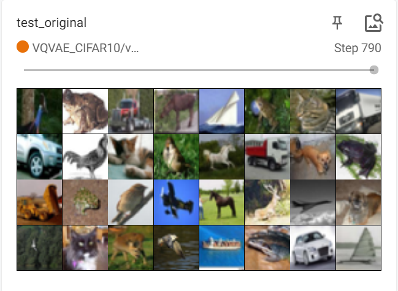
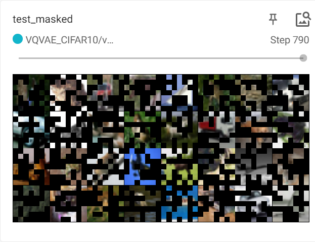
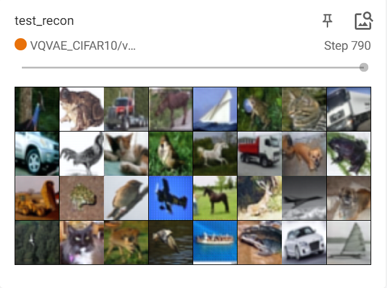
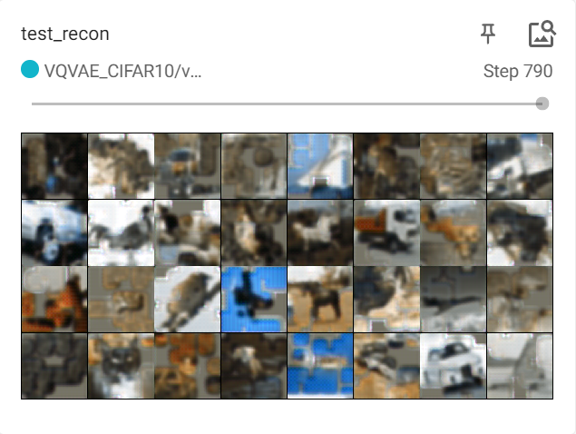
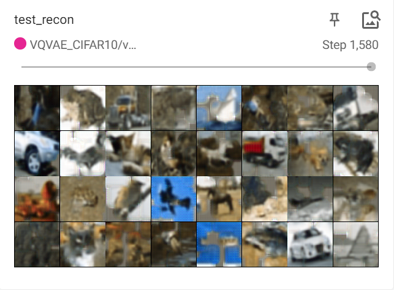
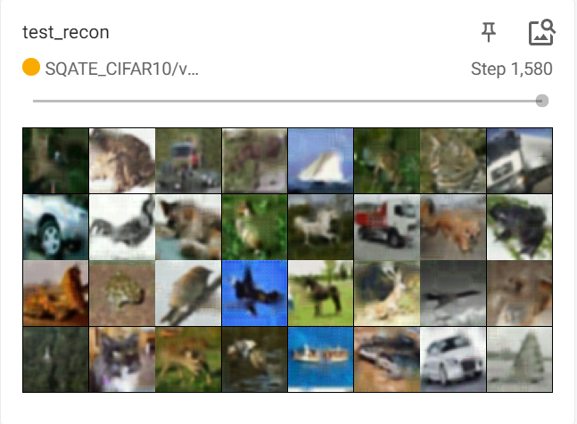

# MinVQVAE

Minimal Discrete Variational Autoencoder (VQ-VAE) implementation in PyTorch.

> Beyond VQ-VAE:2, get crazy performance.

## Performance

| Original | Masked(50%) Test Set | Unmasked Reconstruct(10 epoch) |
|----------|----------------------|--------------------------------|
|  |  |  |

| Masked Reconstruct(10 epoch) | Masked Reconstruct(20 epoch) | Masked+Transformer Reconstruct(20 epoch) |
|-----------------------------|-----------------------------|-----------------------------------------|
|  |  |  |

- 777K unmasked VQVAE with `SoftQuantize` of my implementation
    - get `0.0002233` MSE Loss on CIFAR-10 test set
    - just training 10 epochs cost 11 min on 2x RTX4090 GPUs
- 777K patch_masked(50%) VQVAE with `SoftQuantize` 
    - `0.0092147` MSE Loss on CIFAR-10 test set training 10 epochs cost 13 min
    - `0.00754284` training 20 epochs cost 23 min
- 1.1M patch_masked(50%) VQVAE+transformer with `SoftQuantize` 
    - `0.005134001` MSE Loss on CIFAR-10 test set training 20 epochs cost 49 min

## Others

- profile of trainning unmasked VQ-VAE

| Action                                                                  |  Mean duration (s)  |  Num calls             |  Total time (s)       |  Percentage %         |
|-------------------------------------------------------------------------|---------------------|------------------------|------------------------|-----------------------|
| Total                                                                   |  -                  |  32294                 |  663.84               |  100 %                |
| run_training_epoch                                                      |  56.897             |  10                    |  568.97               |  85.708               |
| [Strategy]DeepSpeedStrategy.validation_step                             |  1.4723             |  222                   |  326.84               |  49.235               |
| run_training_batch                                                      |  0.22579            |  790                   |  178.37               |  26.869               |

- profile of trainning masked VQ-VAE 10 epoch

| Action                                                                  |  Mean duration (s)  |  Num calls             |  Total time (s)       |  Percentage %         |
|-------------------------------------------------------------------------|---------------------|------------------------|------------------------|-----------------------|
| Total                                                                   |  -                  |  32294                 |  788.29               |  100 %                |
| run_training_epoch                                                      |  63.252             |  10                    |  632.52               |  80.24                |
| [Strategy]DeepSpeedStrategy.validation_step                             |  1.7755             |  222                   |  394.16               |  50.002               |
| run_training_batch                                                      |  0.23157            |  790                   |  182.94               |  23.208               |

- profile of trainning masked VQ-VAE 20 epoch

| Action                                                                  |  Mean duration (s)  |  Num calls             |  Total time (s)       |  Percentage %         |
|-------------------------------------------------------------------------|---------------------|------------------------|------------------------|-----------------------|
| Total                                                                   |  -                  |  63874                 |  1392.0               |  100 %                |
| run_training_epoch                                                      |  64.226             |  20                    |  1284.5               |  92.279               |
| [Strategy]DeepSpeedStrategy.validation_step                             |  1.8193             |  422                   |  767.76               |  55.156               |
| run_training_batch                                                      |  0.23081            |  1580                  |  364.68               |  26.198               |

- profile of trainning masked VQ-VAE+transformer 20 epoch

| Action                                                                  |  Mean duration (s)  |  Num calls             |  Total time (s)       |  Percentage %         |
|-------------------------------------------------------------------------|---------------------|------------------------|------------------------|-----------------------|
| Total                                                                   |  -                  |  63874                 |  2980.1               |  100 %                |
| run_training_epoch                                                      |  143.01             |  20                    |  2860.2               |  95.977               |
| run_training_batch                                                      |  1.1792             |  1580                  |  1863.2               |  62.522               |
| [LightningModule]SQATELightning.optimizer_step                           |  1.1791             |  1580                  |  1863.0               |  62.515               |
| [Strategy]DeepSpeedStrategy.backward                                     |  1.1492             |  1580                  |  1815.7               |  60.927               |
| [Strategy]DeepSpeedStrategy.validation_step                              |  2.0247             |  422                   |  854.44               |  28.672               |

## TODO

> To be honest, I'm not sure if I will continue to work on this project. I'm just trying to implement a VQ-VAE for fun. If you have any questions, please feel free to ask me. 🤗🤗🤗

- [ ] Test it on some large dataset, like
    - ImageNet
    - CelebA (or CelebA-HQ)
    - Places365