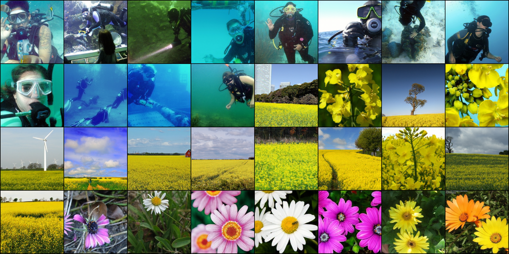

# MinVQVAE

Minimal Discrete Variational Autoencoder (VQ-VAE) implementation in PyTorch.

> Beyond VQ-VAE:2, get crazy performance.

## Performance

### ImageNet

| Dataset | Original | Unmasked Reconstruct(10 epoch) |
|---------|----------|--------------------------------|
| Valid   |  |  |
| Test    |  |  |

- 777K unmasked VQVAE with `SoftQuantize`
    - get `0.0010274` MSE Loss on ImageNet ILSVRC2012 val set
    - training 10 epochs cost 151 min on 4x RTX4090 GPU

### CelebA

| Dataset | Original | Unmasked Reconstruct(10 epoch) |
|---------|----------|--------------------------------|
| Valid   |  |  |
| Test    |  |  |

- 777K unmasked VQVAE with `SoftQuantize`
    - get `0.0001937046` MSE Loss on CelebA test set
    - training 10 epochs cost 68 min on 1x RTX4090 GPU

### CIFAR10

> We also consider masked VQ-VAE for CIFAR10 dataset. (inspired by MAE)

| Original | Masked(50%) Test Set | Unmasked Reconstruct(10 epoch) |
|----------|----------------------|--------------------------------|
|  |  |  |

| Masked Reconstruct(10 epoch) | Masked Reconstruct(20 epoch) | Masked+Transformer Reconstruct(20 epoch) |
|-----------------------------|-----------------------------|-----------------------------------------|
|  |  |  |

- 777K unmasked VQVAE with `SoftQuantize` of my implementation
    - get `0.0002233` MSE Loss on CIFAR-10 test set
    - just training 10 epochs cost 11 min on 2x RTX4090 GPUs
- 777K patch_masked(50%) VQVAE with `SoftQuantize` 
    - `0.0092147` MSE Loss on CIFAR-10 test set training 10 epochs cost 13 min
    - `0.00754284` training 20 epochs cost 23 min
- 1.1M patch_masked(50%) VQVAE+transformer with `SoftQuantize` 
    - `0.005134001` MSE Loss on CIFAR-10 test set training 20 epochs cost 49 min

## Others

- profile of trainning unmasked VQ-VAE on 2x RTX4090 on **CIFAR10**

| Action                                                                  |  Mean duration (s)  |  Num calls             |  Total time (s)       |  Percentage %         |
|-------------------------------------------------------------------------|---------------------|------------------------|------------------------|-----------------------|
| Total                                                                   |  -                  |  32294                 |  663.84               |  100 %                |
| run_training_epoch                                                      |  56.897             |  10                    |  568.97               |  85.708               |
| [Strategy]DeepSpeedStrategy.validation_step                             |  1.4723             |  222                   |  326.84               |  49.235               |
| run_training_batch                                                      |  0.22579            |  790                   |  178.37               |  26.869               |

- profile of trainning masked VQ-VAE 10 epoch on 2x RTX4090 on **CIFAR10**

| Action                                                                  |  Mean duration (s)  |  Num calls             |  Total time (s)       |  Percentage %         |
|-------------------------------------------------------------------------|---------------------|------------------------|------------------------|-----------------------|
| Total                                                                   |  -                  |  32294                 |  788.29               |  100 %                |
| run_training_epoch                                                      |  63.252             |  10                    |  632.52               |  80.24                |
| [Strategy]DeepSpeedStrategy.validation_step                             |  1.7755             |  222                   |  394.16               |  50.002               |
| run_training_batch                                                      |  0.23157            |  790                   |  182.94               |  23.208               |

- profile of trainning masked VQ-VAE 20 epoch on 2x RTX4090 on **CIFAR10**

| Action                                                                  |  Mean duration (s)  |  Num calls             |  Total time (s)       |  Percentage %         |
|-------------------------------------------------------------------------|---------------------|------------------------|------------------------|-----------------------|
| Total                                                                   |  -                  |  63874                 |  1392.0               |  100 %                |
| run_training_epoch                                                      |  64.226             |  20                    |  1284.5               |  92.279               |
| [Strategy]DeepSpeedStrategy.validation_step                             |  1.8193             |  422                   |  767.76               |  55.156               |
| run_training_batch                                                      |  0.23081            |  1580                  |  364.68               |  26.198               |

- profile of trainning masked VQ-VAE+transformer 20 epoch on 2x RTX4090 on **CIFAR10**

| Action                                                                  |  Mean duration (s)  |  Num calls             |  Total time (s)       |  Percentage %         |
|-------------------------------------------------------------------------|---------------------|------------------------|------------------------|-----------------------|
| Total                                                                   |  -                  |  63874                 |  2980.1               |  100 %                |
| run_training_epoch                                                      |  143.01             |  20                    |  2860.2               |  95.977               |
| run_training_batch                                                      |  1.1792             |  1580                  |  1863.2               |  62.522               |
| [LightningModule]SQATELightning.optimizer_step                           |  1.1791             |  1580                  |  1863.0               |  62.515               |
| [Strategy]DeepSpeedStrategy.backward                                     |  1.1492             |  1580                  |  1815.7               |  60.927               |
| [Strategy]DeepSpeedStrategy.validation_step                              |  2.0247             |  422                   |  854.44               |  28.672               |

- profile of trainning unmasked VQ-VAE 10 epoch on 1x RTX4090 on **CelebA**

| Action                                                                  |  Mean duration (s)  |  Num calls             |  Total time (s)       |  Percentage %         |
|-------------------------------------------------------------------------|---------------------|------------------------|------------------------|-----------------------|
| Total                                                                   |  -                  |  242558                |  4114.8               |  100 %                |
| run_training_epoch                                                      |  356.79             |  10                    |  3567.9               |  86.71                |
| [Strategy]DeepSpeedStrategy.validation_step                             |  2.0047             |  860                   |  1724.1               |  41.899               |
| run_training_batch                                                      |  0.23014            |  6360                  |  1463.7               |  35.572               |
| [LightningModule]VQVAEUnmaskLightning.optimizer_step                    |  0.23003            |  6360                  |  1463.0               |  35.555               |
| [Strategy]DeepSpeedStrategy.backward                                    |  0.20474            |  6360                  |  1302.1               |  31.645               |

- profile of trainning masked VQ-VAE 10 epoch on 4x RTX4090 on **ImageNet**

| Action                                                                  |  Mean duration (s)  |  Num calls             |  Total time (s)       |  Percentage %         |
|-------------------------------------------------------------------------|---------------------|------------------------|------------------------|-----------------------|
| Total                                                                   |  -                  |  200608                |  9061.3               |  100 %                |
| run_training_epoch                                                      |  848.99             |  10                    |  8489.9               |  93.694               |
| [Strategy]DeepSpeedStrategy.validation_step                             |  3.1335             |  1388                  |  4349.3               |  47.998               |
| run_training_batch                                                      |  0.5715             |  5010                  |  2863.2               |  31.598               |
| [LightningModule]VQVAEUnmaskLightning.optimizer_step                    |  0.57134            |  5010                  |  2862.4               |  31.589               |
| [Strategy]DeepSpeedStrategy.backward                                    |  0.53434            |  5010                  |  2677.0               |  29.544               |
| [_TrainingEpochLoop].train_dataloader_next                              |  0.087691           |  5010                  |  439.33               |  4.8484               |
| [Strategy]DeepSpeedStrategy.batch_to_device                             |  0.062455           |  6423                  |  401.15               |  4.427                |

## TODO

> To be honest, I'm not sure if I will continue to work on this project. I'm just trying to implement a VQ-VAE for fun. If you have any questions, please feel free to ask me. 🤗🤗🤗

- [x] Test it on some large dataset, like
    - [x] ImageNet
    - [x] CelebA (or CelebA-HQ)